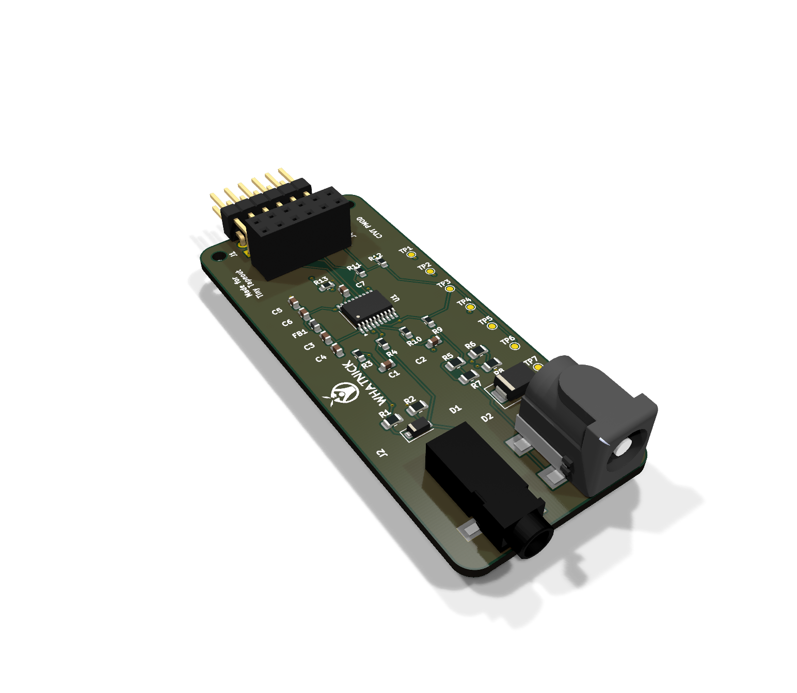
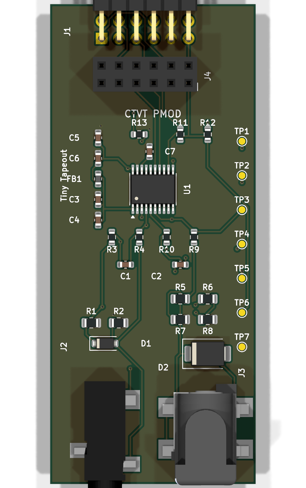
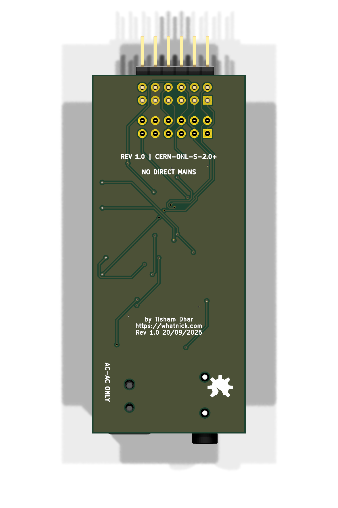

# CTVT PMOD



CTVT PMOD is a compact, open-hardware analog front end for phase-coherent
current and voltage sampling. It uses a TI ADS131M02 dual 24-bit delta-sigma
ADC and is intended for energy-monitoring DSP experiments, including Tiny
Tapeout ASIC projects.

The routed KiCad 10 design is 30 mm x 70 mm. The PMOD connectors are at one
short edge; the CT and AC/AC transformer inputs face away from them at the
opposite edge so adjacent PMODs remain usable.

The narrow layout keeps the measurement front end beside other PMODs rather
than blocking them. Both field connectors project beyond the board edge for
comfortable cable access, while the vertical female header provides a second
PMOD connection for stacking or logic-analyzer access.

| Component side | Rear silkscreen and routing |
|---|---|
|  |  |

## Digital companion

The [CTVT Energy DSP](https://github.com/whatnick/tt-ctvt-energy-dsp)
repository contains the companion Tiny Tapeout design. Its working first stage
captures ADS131M02 frames, performs time-shared multiply-accumulate operations,
and publishes coherent voltage, current, and active-power moments over a host
SPI interface. The roadmap adds calibrated RMS and energy, phase/frequency,
power-quality events, and resource-efficient Goertzel harmonic analysis.

## Signal path

```text
CT jack -> split burden -> protection -> differential RC filter --+
                                                                   |
AC/AC jack -> balanced divider -> protection -> differential RC ---+-> ADS131M02
                                                                        |
3.3 V PMOD <---------------- SPI, DRDY, RESET, CLK ----------------------+
```

- **Current channel:** Same Sky `SJ-3523-SMT-TR` 3.5 mm stereo jack, with
  tip and sleeve as the differential CT input and ring grounded. Two 6.49 ohm
  0.1% burden resistors form a 12.98 ohm differential burden. The jack's
  mating face overhangs the field edge by 2.0 mm so a right-angle plug body
  clears the PCB.
- **Voltage channel:** Same Sky `PJ-002BH-SMT-TR` barrel jack for an isolated
  9-12 VAC transformer. Each leg uses a 100 kohm / 6.49 kohm balanced divider.
- **Filtering:** Each ADC channel has two 1 kohm series resistors and a 10 nF
  C0G differential capacitor, giving an approximate 8 kHz differential pole.
- **Assembly:** All chip passives are 0603 or larger and every fitted
  reference designator is present on silkscreen.
- **Protection:** `SMF3.3CA` on the CT input and `SMBJ18CA` on the transformer
  input.
- **Conversion:** ADS131M02 with filtered analog power, local decoupling,
  seven test points, and simultaneous voltage/current sampling.

## PMOD interface

J1 is the right-angle male peripheral connector. J4 is a vertical female
Wurth `613012243121` pass-through socket; all twelve pins are connected
one-to-one for PMOD chaining.

| Pin | Signal | Direction at CTVT | Purpose |
|---:|---|---|---|
| 1 | CS | Input | SPI chip select |
| 2 | MOSI | Input | SPI data to ADC |
| 3 | MISO | Output | SPI data from ADC |
| 4 | SCLK | Input | SPI clock |
| 5 | GND | Power | Ground |
| 6 | +3V3 | Power | Regulated 3.3 V input |
| 7 | DRDY | Output | Conversion-ready interrupt |
| 8 | RESET | Input | ADC reset |
| 9 | CLK_HOST | Input | Optional external ADC clock |
| 10 | RESERVED | Pass-through | Reserved chained signal |
| 11 | GND | Power | Ground |
| 12 | +3V3 | Power | Regulated 3.3 V input |

## Scaling and calibration

The CT channel differential voltage is:

```text
V_CT_RMS = I_secondary_RMS x 12.98 ohm
```

For example, a 100 A : 50 mA CT produces approximately 0.649 Vrms at rated
primary current. Confirm the selected CT's maximum secondary current and
fault behavior before connection.

The voltage channel nominal divider ratio is:

```text
6.49 kohm / (100 kohm + 6.49 kohm) = 0.06095
```

A 9-12 Vrms isolated transformer therefore produces approximately
0.549-0.731 Vrms differential at the ADC input. Configure the ADS131M02 gain
for the resulting peak voltage and retain headroom for transformer regulation
and mains excursions.

Calibrate voltage gain, current gain, phase, and channel offset against a
traceable low-voltage source before calculating power. TP1-TP4 expose the four
ADC inputs; TP5 is DRDY, TP6 is +3V3, and TP7 is GND.

## Safety

**Use only an isolated CT and a certified isolated AC/AC transformer. Never
connect mains directly to this board.** The barrel jack is an isolated
low-voltage AC input, not a DC supply input. Enclosure, wiring, fusing,
creepage, clearance, and regulatory compliance remain the responsibility of
the final system.

## Build and outputs

Open `ctvt-pmod.kicad_pro` in KiCad 10. The committed schematic and PCB are
complete and routed. Project-local connector footprints and STEP models avoid
dependencies on the ATM90E26 FeatherWing repository.

The design sources are generated in this order:

```powershell
python scripts\generate_schematic.py
& "C:\Program Files\KiCad\10.0\bin\python.exe" scripts\generate_board.py
# Export a Specctra DSN, route it, and save the result as routing\ctvt-pmod.ses.
& "C:\Program Files\KiCad\10.0\bin\python.exe" scripts\finalize_route.py
```

`scripts/finalize_route.py` imports the saved Freerouting session, normalizes
all traces to at least 0.20 mm, moves the stereo jack so its mating face
overhangs the PCB edge by 2.0 mm, adds the rear OSHW/Whatnick branding, and
fills GND zones on both copper layers. Run `scripts\adjust_stereo_jack.py` or
`scripts\add_branding.py` independently to reapply only that post-route change.
Manufacturing exports are generated into ignored `gerbers/` and `bom/`
directories.

## Repository contents

- `ctvt-pmod.kicad_sch` - complete schematic
- `ctvt-pmod.kicad_pcb` - routed two-layer PCB
- `ctvt-pmod.pretty/` - project-local barrel-jack and PMOD socket footprints
- `models/step/` - project-local connector STEP models
- `routing/ctvt-pmod.ses` - saved autorouter result
- `scripts/` - deterministic schematic, placement, and routing finalization

Licensed under CERN-OHL-S-2.0-or-later.
